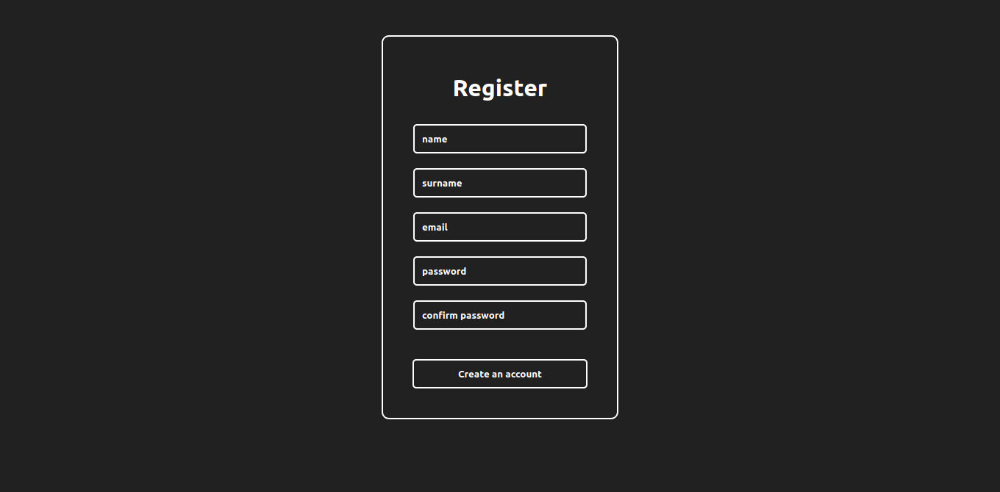

# day-07-in-30-days-of-react 

- in this project I make a VERY SIMPLE form validator in using hooks, and later i will add a more advanced validator, considering the validation part of the second password

# result image  

